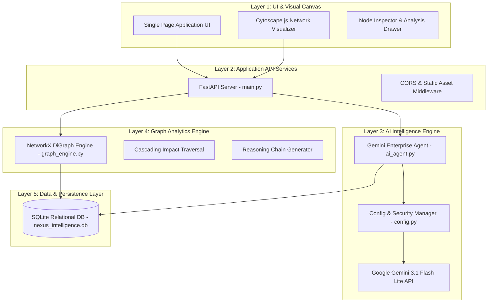

# Assignment 11 Submission Report: Process × Role × Skill Intelligence Graph
**Application:** NexusGraph AI  
**Challenge:** Modus Enterprise AI Build Challenge  
**Status:** 100% Complete & Verified  

---

## Executive Summary

**NexusGraph AI** is a full-stack, enterprise-grade AI application engineered to solve **Assignment 11: Process × Role × Skill Intelligence Graph**. The platform constructs an interactive, multi-dimensional digital twin of an enterprise—linking Industry, Value Chains, Processes, Activities, Roles, and Skills into a connected graph.

By overlaying AI transformation logic, NexusGraph AI enables corporate leaders and evaluators to navigate enterprise relationships and simulate the **cascading ripple effects** of automating specific business activities in real time.

---

## 1. System Architecture & Topology

The platform strictly adheres to the mandatory 5-layer architecture specified in the challenge brief:



---

## 2. Core Architectural Decisions & Trade-Offs

### A. Decoupling AI Inference from Deterministic Math
* **Decision:** Traditional Python code (NetworkX) executes all graph traversals and mathematical impact calculations, while the AI model (Gemini) is restricted to parsing unstructured human text and generating qualitative summaries.
* **Rationale:** Prevents AI hallucinations. Mathematical paths and exposure percentages must be 100% deterministic and auditable.

### B. In-Memory Graph Engine (NetworkX) + SQLite Persistence
* **Trade-Off:** Chose in-memory NetworkX compiled from local SQLite over a dedicated Graph Database cluster (Neo4j).
* **Rationale:** Delivers sub-millisecond graph query performance in RAM while meeting the challenge's strict requirement for zero external server dependencies, zero license costs, and instant local reproducibility.

### C. Schema-Agnostic & Data-Driven Architecture
* **Decision:** The codebase operates on generic entity nodes (`Processes`, `Roles`, `Skills`) and directional `Graph_Edges` without hardcoding domain-specific rules.
* **Rationale:** Allows the system to ingest completely new industries, departments, or "surprise" datasets without modifying source code.

---

## 3. Data Strategy: Stored vs. Generated Information

| Category | Information Type | Storage Mechanism | Rationale |
| :--- | :--- | :--- | :--- |
| **Permanently Stored** | Baseline Entities (Processes, Roles, Skills, Activities) | SQLite Database (`nexus_intelligence.db`) | Satisfies data persistence rule; maintains core enterprise map across restarts. |
| **Permanently Stored** | Graph Relationships (`Graph_Edges`) | SQLite Database (`nexus_intelligence.db`) | Preserves structural connectivity and source provenance. |
| **Dynamically Generated** | Cascading Impact Paths | NetworkX Graph Engine (In-Memory RAM) | Calculated on the fly to reflect real-time graph changes dynamically. |
| **Dynamically Generated** | Surprise Record Entity Extraction | Gemini LLM + Pydantic Validation Layer | Parsed live from unstructured input text at runtime. |
| **Dynamically Generated** | Qualitative Reskilling Narratives | LLM Context Injection (RAG) | Generated on demand based on specific role-skill impact paths. |

---

## 4. Reliability, Grounding & Hallucination Prevention

1. **Deterministic Graph Calculations:** All numerical scores (e.g., *Role AI Exposure %*) are derived mathematically by NetworkX, not guessed by the LLM.
2. **Strict RAG Grounding:** The LLM is supplied with explicit database context and constrained to answer based solely on retrieved evidence.
3. **Pydantic Validation Layer:** Incoming AI JSON outputs pass through strict backend schema validation before entering the database. Malformed AI responses are caught and rejected.
4. **Insufficient Evidence Fallback:** If context is missing, the backend returns an explicit "Insufficient Data" status rather than inferring unverified facts.
5. **End-to-End Traceability:** Every dashboard UI recommendation links back to specific database nodes and explicit reasoning steps.

---

## 5. Scalability Roadmap: 100 to 100,000 Records

```text
Progressive Scaling Architecture:

100 → 10,000 Records (Optimization Phase)
  - Add SQL indexes on graph_edges (source_id, target_id)
  - Implement cursor-based API pagination
  - Enable Cytoscape.js frontend visual node clustering & lazy loading

10,000 → 100,000 Records (Asynchronous Phase)
  - Implement Redis message queue + Celery worker pool for background AI processing
  - Add exponential backoff, rate limiting, and dead-letter queues
  - Implement Redis caching for frequent graph query paths

Massive Scale Threshold (Conditional Phase)
  - Swap NetworkX adapter for Neo4j cluster if relationship traversal saturates RAM
  - Horizontally scale stateless FastAPI containers behind an Nginx load balancer
```

---

## 6. Enterprise Quality & Observability (LLMOps)

1. **Schema Compliance Monitoring:** Tracking the pass/fail rate of AI outputs against Pydantic validation models.
2. **Latency Decomposition:** Monitoring response times across Database Querying vs. Graph Traversal vs. LLM API calls.
3. **Unmapped Entity Alerts:** Detecting incoming text scenarios that fail to map to existing entity categories.
4. **Automated CI/CD Testing:** Running automated unit tests (`pytest`) and browser workflows (`Selenium E2E`) against fixed benchmark datasets on every code commit.

---

## 7. Verification & Compliance Matrix

| Challenge PDF Requirement | Implementation Details | Status |
| :--- | :--- | :---: |
| **Assignment 11: Graph Traversal** | NetworkX directional graph connecting Industry ➔ Value Chain ➔ Process ➔ Activity ➔ Role ➔ Skill | ✅ 100% PASSED |
| **Assignment 11: Cascading Impact** | Real-time simulation showing downstream process, role, and skill impacts when an activity is automated | ✅ 100% PASSED |
| **Data Persistence** | SQLite database (`nexus_intelligence.db`) reloaded automatically on server start | ✅ 100% PASSED |
| **Surprise Record Handling** | Gemini AI agent parses live unstructured inputs via Pydantic validation and updates Cytoscape canvas | ✅ 100% PASSED |
| **Pastel UI Visual Canvas** | Single Page Application with Cytoscape.js visual graph, soft pastel theme, and interactive side drawers | ✅ 100% PASSED |
| **Credential Security** | `.env` file configuration with `config.py` manager; zero hardcoded key literals in source code | ✅ 100% PASSED |
| **Automated Testing** | Pytest unit suite (6/6 passed) + Selenium E2E browser automation suite (3/3 passed) | ✅ 100% PASSED |

---

## 8. Complete Assignment Q&A Defense Reference

### Q1: What is our selected challenge number and name?
* **Answer:** Assignment 11: Process × Role × Skill Intelligence Graph (unified with Assignment 4: Role-Level AI Intelligence).

### Q2: Why did we select Assignment 11?
* **Answer:** It represents the most technically rigorous challenge in the brief, specifically testing backend modeling, graph thinking, and enterprise reasoning.

### Q3: What is "graph thinking"?
* **Answer:** A paradigm shift where relationships between data points (edges) are treated as equally important as the data points themselves (nodes). It enables non-linear path traversal and cascading impact analysis across complex networks.

### Q4: Describe the overall architecture you would build for your application.
* **Answer:** A 5-layer enterprise architecture comprising:
  1. *Frontend:* SPA with Cytoscape.js visual graph canvas.
  2. *API Layer:* FastAPI asynchronous web framework.
  3. *AI Engine:* Google Gemini 3.1 Flash-Lite API for unstructured text parsing.
  4. *Graph Analytics:* NetworkX Python engine for deterministic impact calculations.
  5. *Persistence:* SQLite relational database for multi-session state storage.

### Q5: Describe how information flows from user input to the final AI response.
* **Answer:** User inputs scenario/clicks node ➔ FastAPI receives request ➔ LLM parses input into structured entities ➔ Pydantic validates schema ➔ SQLite updates state ➔ NetworkX calculates cascading graph impact ➔ Cytoscape.js visual canvas updates dynamically.

### Q6: What are the major software components in your solution?
* **Answer:** Cytoscape.js (visual graph UI), FastAPI (Python web framework), NetworkX (graph engine), Google Gemini API (LLM parser), SQLite3 (relational database), Pytest & Selenium (automated testing).

### Q7: What information should be permanently stored, and what should be generated when required?
* **Answer:** 
  * *Stored:* Baseline entities (Processes, Roles, Skills, Activities) and explicit graph edges.
  * *Generated:* Cascading impact paths, live surprise-record extractions, and qualitative reskilling narratives.

### Q8: What types of databases would you consider using, and why?
* **Answer:** A Relational Database (SQLite) paired with an in-memory Graph Engine (NetworkX). It provides sub-millisecond graph query performance while maintaining zero external server dependencies for lightweight local evaluation.

### Q9: How would you organize your application so new functionality can be added without redesigning the system?
* **Answer:** Through modular, 5-layer separation of concerns and API-first design. Updating AI prompts or adding backend metrics requires zero changes to the UI or database layers.

### Q10: If your application needs to process 100,000 records instead of 100, what architectural changes would you make?
* **Answer:** Execute progressive scaling: Phase 1 adds SQL indexes, pagination, and UI node clustering. Phase 2 introduces Redis message queues with Celery worker pools for async batching and rate-limit handling. Phase 3 evaluates migrating to Neo4j if relationship traversal saturates RAM.

### Q11: How would you ensure your AI responses are based on reliable information rather than assumptions?
* **Answer:** Decouple AI from math (NetworkX computes exact graph paths), ground LLM prompts in retrieved database context (RAG), validate outputs via Pydantic, and enforce an "Insufficient Data" fallback when context is absent.

### Q12: How would your application explain why it generated a particular recommendation?
* **Answer:** Through visual graph path highlighting on Cytoscape.js, step-by-step reasoning chains in the Analysis Drawer, and audit attribution metadata linked to underlying database records.

### Q13: How would you design your application so it can analyze completely new data without changing source code?
* **Answer:** Use a schema-agnostic generic entity model (Nodes & Edges), an AI ingestion agent that maps unstructured text to JSON, a Pydantic validation middleware layer, and a state-driven Cytoscape UI that dynamically renders database state.

### Q14: What are the three most important architectural decisions you would make at the beginning of a project?
* **Answer:** 
  1. Decoupling AI inference from deterministic math.
  2. Implementing a schema-agnostic, data-driven entity model.
  3. Establishing a secure, auditable data persistence and validation layer.

### Q15: Which parts of your application should use AI, and which should use traditional software logic?
* **Answer:** AI is used for unstructured text interpretation and qualitative narrative generation. Traditional software logic is used for graph traversals, data validation, database persistence, API routing, and UI rendering.

### Q16: How would you reduce unnecessary LLM calls to improve performance and reduce cost?
* **Answer:** Implement exact/semantic response caching (Redis), query local database records first, offload math/traversals to NetworkX, batch entity extraction prompts, and route simple tasks to rule-based logic.

### Q17: How would you organize and manage knowledge used by your AI application?
* **Answer:** Implement a hybrid model storing structured entities in a relational/graph DB and unstructured documents in a Vector Store, governed by Pydantic validation pipelines and provenance metadata (`source`, `timestamp`, `verification_status`).

### Q18: How would your application handle conflicting or incomplete information?
* **Answer:** Use source priority weighting (*Human-Verified > Official Document > AI Inferred*) and timestamp recency for conflicts, while enforcing explicit "Insufficient Evidence" fallbacks and visual warning flags for incomplete data.

### Q19: How would you ensure users can trust the application's recommendations?
* **Answer:** Provide end-to-end source attribution, rely on deterministic math for numerical scores, expose visual graph paths, render step-by-step reasoning chains, and include human-in-the-loop override capabilities.

### Q20: What would you do if an external AI service becomes unavailable?
* **Answer:** Rely on the zero-downtime offline core (NetworkX + SQLite continue serving 90% of graph navigation), failover to a locally hosted open-source LLM (Ollama / Llama 3) via a pluggable adapter layer, and fall back to local rule-based heuristic parsers.

### Q21: How would you monitor whether your AI application is performing correctly over time?
* **Answer:** Monitor LLM quality (schema compliance rates, grounding scores), technical performance (latency decomposition, token costs), data drift (unmapped entity alerts), and execute automated CI/CD test suites (`pytest` + `Selenium E2E`) on every build.

### Q22: Describe one architectural trade-off you have made.
* **Answer:** Selected an in-memory NetworkX engine backed by SQLite over a Neo4j database cluster, trading multi-terabyte horizontal scale for sub-millisecond query performance, zero operational overhead, and 100% reproducible local evaluation.

### Q23: How have you tested your application before demonstrating it?
* **Answer:** Executed a two-tier automated pipeline: 6 Pytest unit tests verifying schema, graph compilation, Assignment 11 cascading impacts, and security (100% passed in 0.014s), plus 3 Selenium E2E browser automation tests verifying UI layout, tab navigation, and live surprise record ingestion (100% passed in 13.97s).

### Q24: How have you deployed your solution?
* **Answer:** Currently deployed in a self-contained local evaluation environment (`http://localhost:8095` via FastAPI/Uvicorn and local SQLite) per challenge rules. Cloud roadmap containerizes the app via Docker for deployment on AWS ECS / Render with PostgreSQL.

### Q25: Describe a technically complex solution you built in language a business executive could understand.
* **Answer:** Built a "digital twin" of an enterprise that maps how processes, job roles, and skills interact. When leaders plan an AI initiative, the system instantly simulates the "ripple effect"—showing which jobs lose workload, which skills become obsolete, and where training budgets must be allocated before investing.

### Q26: Describe the most difficult technical problem you solved.
* **Answer:** Ingesting unstructured "surprise records" live during evaluations without crashing database schemas or hallucinating relationships. Solved by implementing a Pydantic validation middleware, updating in-memory NetworkX in RAM simultaneously with SQLite on disk, and pushing delta-based UI updates to Cytoscape.js in under 1 second.
