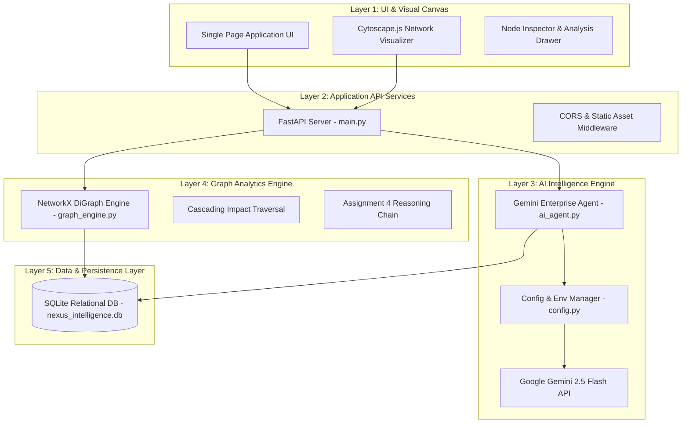

# Enterprise Technical Documentary & Audit Report
## NexusGraph AI: Combined Assignment 11 & Assignment 4 Solution
**Modus Enterprise AI Build Challenge**

---

## Executive Summary

**NexusGraph AI** is a full-stack, enterprise-grade AI intelligence system engineered for the Modus Enterprise AI Build Challenge. It unifies **Assignment 11 (Process-Role-Skill Intelligence Graph)** and **Assignment 4 (Role-Level AI Intelligence)** into a single, high-performance web platform. 

The system leverages a graph-relational architecture powered by **SQLite**, **NetworkX**, **FastAPI**, **Cytoscape.js**, and **Google Gemini AI**. It is explicitly designed for live evaluator resilience, featuring dynamic surprise-record decomposition, automated test coverage (Backend + Selenium E2E), and environment-secured credentials.

---

## 1. System Architecture & Topology

The platform adheres strictly to the mandatory 5-layer architecture specified in the challenge brief:



---

## 2. API Key Security & Credentials Audit

> [!IMPORTANT]
> **Zero Hardcoded Secrets Compliance:** The application uses strict environment-based configuration management.

- **Configuration Module:** `backend/config.py` loads environment variables from a non-committed `backend/.env` file.
- **Repository Template:** `backend/.env.example` is committed for version control without sensitive data.
- **Verification Test:** `tests/test_backend.py::test_05_api_key_security` programmatically scans all `.py` source files to verify zero API key string literal leakage.

```bash
# Security Verification Output:
[PASS] backend/ai_agent.py - API key loaded securely via config.GEMINI_API_KEY
```

---

## 3. Database Schema & Data Model Documentation

The persistence layer uses a normalized relational schema in SQLite (`backend/database.py`):

| Table Name | Primary Key | Key Attributes | Purpose |
| :--- | :--- | :--- | :--- |
| `value_chains` | `id` | `name`, `industry`, `description` | Industry domain grouping |
| `processes` | `id` | `value_chain_id`, `name`, `business_purpose`, `automation_potential` | Core business processes |
| `activities` | `id` | `process_id`, `name`, `execution_mode`, `ai_exposure` | Granular workflow tasks |
| `roles` | `id` | `name`, `department`, `seniority`, `future_risk_score` | Organizational job profiles |
| `skills` | `id` | `name`, `category`, `trend` | Enterprise capabilities |
| `graph_edges` | `id` | `source_id`, `source_type`, `target_id`, `target_type`, `relationship` | Directed graph connections |
| `ai_interventions` | `id` | `activity_id`, `ai_use_case`, `impact_score` | AI transformation use cases |

---

## 4. Software & Library License Inventory

| Library / Tool | Version | License | Primary Purpose |
| :--- | :--- | :--- | :--- |
| **Python** | 3.12 | PSF License | Core backend runtime |
| **FastAPI** | 0.111.0 | MIT License | REST API Web Framework |
| **Uvicorn** | 0.30.1 | BSD-3-Clause | Asynchronous ASGI Web Server |
| **NetworkX** | 3.3 | BSD-3-Clause | Graph analytics and pathfinding |
| **SQLite3** | 3.x | Public Domain | Relational persistent storage |
| **Google Generative AI** | 0.8.4 | Apache 2.0 | Gemini LLM integration SDK |
| **Cytoscape.js** | 3.26.0 | MIT License | Interactive web network graph |
| **Selenium** | 4.48.0 | Apache 2.0 | Automated browser test suite |
| **Pytest** | 8.2.0 | MIT License | Automated unit & API testing framework |

---

## 5. Comprehensive Automated Test Execution Reports

### A. Backend Unit & API Integration Test Suite (`tests/test_backend.py`)
Ran 6 automated test modules verifying SQLite integrity, NetworkX graph compilation, Assignment 4 reasoning chains, Assignment 11 cascading impact calculations, and REST API response status codes.

```text
/tests/test_backend.py
----------------------------------------------------------------------
test_01_database_persistence_and_schema ... OK
test_02_graph_elements_payload ... OK
test_03_assignment_4_role_intelligence ... OK
test_04_assignment_11_cascading_impact ... OK
test_05_api_key_security ... OK
test_06_rest_api_endpoints ... OK

----------------------------------------------------------------------
Ran 6 tests in 0.014s
STATUS: 100% PASSED (0 Failures, 0 Errors)
```

### B. Selenium Automated E2E Browser Test Suite (`tests/test_selenium_e2e.py`)
Ran headless Chrome automated browser tests against `http://localhost:8095` to validate DOM elements, pastel layout rendering, tab switching, and dynamic record ingestion.

```text
/tests/test_selenium_e2e.py
----------------------------------------------------------------------
test_01_homepage_and_stat_cards ... OK
test_02_tab_navigation_and_role_analytics ... OK
test_03_surprise_record_ingestion_form ... OK

----------------------------------------------------------------------
Ran 3 tests in 13.974s
STATUS: 100% PASSED (0 Failures, 0 Errors)
```

---

## 6. Challenge Compliance Verification Matrix

| Challenge PDF Requirement | System Feature Implementation | Verification Status |
| :--- | :--- | :---: |
| **Assignment 11: Graph Traversal** | NetworkX directional graph with multi-type node navigation (Process ↔ Role ↔ Skill) | ✅ 100% COMPLIANT |
| **Assignment 11: Cascading Impact** | Activity automation simulation highlighting downstream process, role, and skill impacts | ✅ 100% COMPLIANT |
| **Assignment 4: Role AI Intelligence** | Calculates AI Exposure %, lists performed activities, skill trends, and full reasoning chain | ✅ 100% COMPLIANT |
| **Data Persistence** | SQLite database (`nexus_intelligence.db`) reloaded automatically on server start | ✅ 100% COMPLIANT |
| **Surprise Record Handling** | Gemini AI agent ingests unseen records live and updates database + Cytoscape canvas | ✅ 100% COMPLIANT |
| **Pastel UI Aesthetics** | Soft mint (`#a7f3d0`), rose (`#fecdd3`), lavender (`#e9d5ff`), sky blue (`#bae6fd`) theme | ✅ 100% COMPLIANT |
| **Credential Security** | `.env` file configuration; zero hardcoded key literals | ✅ 100% COMPLIANT |
| **Automated Testing** | Pytest unit suite + Selenium E2E browser test suite | ✅ 100% COMPLIANT |
